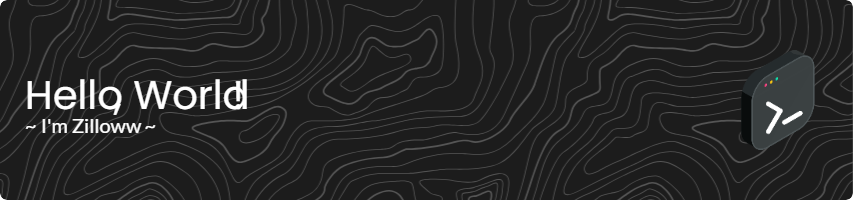

<h1 align="center">Hi 👋, I'm Zilloww</h1>
<h3 align="center">A Fullstack web developer from Switzerland.</h3>


<p align="left">  </p>


- 🌱 I’m currently learning **Flutter**

- 👯 I’m looking to collaborate on [Drupal](git.drupalcode.org)

- ⚡ Fun fact **I spent 2 hours making a nice Github profile, only to start over and make this one.**

<h3 align="left">Connect with me:</h3>
<p align="left">
<a href="https://www.leetcode.com/zilloww" target="blank"></a>
</p>

<h3 align="left">Languages and Tools:</h3>
<p align="left"> <a href="https://www.w3schools.com/css/" target="_blank" rel="noreferrer">  </a> <a href="https://www.djangoproject.com/" target="_blank" rel="noreferrer">  </a> <a href="https://www.docker.com/" target="_blank" rel="noreferrer">  </a> <a href="https://www.electronjs.org" target="_blank" rel="noreferrer">  </a> <a href="https://expressjs.com" target="_blank" rel="noreferrer">  </a> <a href="https://www.figma.com/" target="_blank" rel="noreferrer">  </a> <a href="https://firebase.google.com/" target="_blank" rel="noreferrer">  </a> <a href="https://flask.palletsprojects.com/" target="_blank" rel="noreferrer">  </a> <a href="https://flutter.dev" target="_blank" rel="noreferrer">  </a> <a href="https://git-scm.com/" target="_blank" rel="noreferrer">  </a> <a href="https://heroku.com" target="_blank" rel="noreferrer">  </a> <a href="https://www.w3.org/html/" target="_blank" rel="noreferrer">  </a> <a href="https://developer.mozilla.org/en-US/docs/Web/JavaScript" target="_blank" rel="noreferrer">  </a> <a href="https://www.linux.org/" target="_blank" rel="noreferrer">  </a> <a href="https://www.mongodb.com/" target="_blank" rel="noreferrer">  </a> <a href="https://www.mysql.com/" target="_blank" rel="noreferrer">  </a> <a href="https://nodejs.org" target="_blank" rel="noreferrer">  </a> <a href="https://nuxtjs.org/" target="_blank" rel="noreferrer">  </a> <a href="https://opencv.org/" target="_blank" rel="noreferrer">  </a> <a href="https://www.php.net" target="_blank" rel="noreferrer">  </a> <a href="https://www.postgresql.org" target="_blank" rel="noreferrer">  </a> <a href="https://postman.com" target="_blank" rel="noreferrer">  </a> <a href="https://github.com/puppeteer/puppeteer" target="_blank" rel="noreferrer">  </a> <a href="https://www.python.org" target="_blank" rel="noreferrer">  </a> <a href="https://reactjs.org/" target="_blank" rel="noreferrer">  </a> <a href="https://sass-lang.com" target="_blank" rel="noreferrer">  </a> <a href="https://www.sqlite.org/" target="_blank" rel="noreferrer">  </a> <a href="https://symfony.com" target="_blank" rel="noreferrer">  </a> <a href="https://tailwindcss.com/" target="_blank" rel="noreferrer">  </a> <a href="https://www.typescriptlang.org/" target="_blank" rel="noreferrer">  </a> <a href="https://unity.com/" target="_blank" rel="noreferrer">  </a> <a href="https://www.vagrantup.com/" target="_blank" rel="noreferrer">  </a> <a href="https://vuejs.org/" target="_blank" rel="noreferrer">  </a> <a href="https://vuetifyjs.com/en/" target="_blank" rel="noreferrer">  </a> <a href="https://zapier.com" target="_blank" rel="noreferrer">  </a> </p>

<h3 align="left">Stats:</h3>
<p>&nbsp;</p>
<p></p>
<p align="left"> <a href="https://github.com/ryo-ma/github-profile-trophy"></a> </p>
<p>
  <!--START_SECTION:waka-->

```txt
Total Time: 2 hrs 22 mins

PHP          1 hr 56 mins    ████████████████████▒░░░░   81.74 %
JavaScript   8 mins          █▓░░░░░░░░░░░░░░░░░░░░░░░   06.29 %
Twig         4 mins          ▓░░░░░░░░░░░░░░░░░░░░░░░░   02.86 %
CSS          1 min           ▒░░░░░░░░░░░░░░░░░░░░░░░░   01.14 %
```

<!--END_SECTION:waka-->
</p>

<h3 align="left">Support:</h3>
<p><a href="https://www.buymeacoffee.com/zilloww"> </a></p><br><br>
